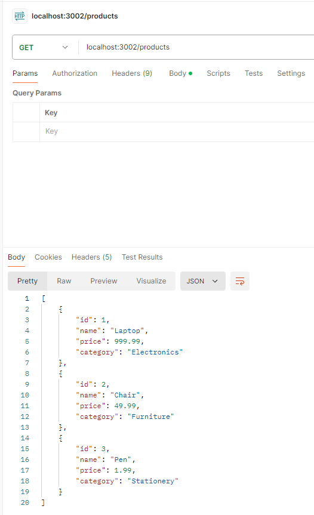
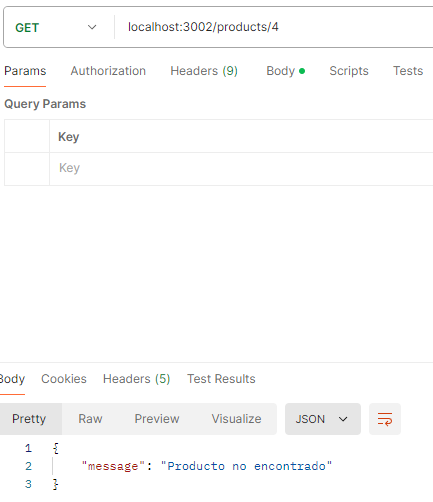
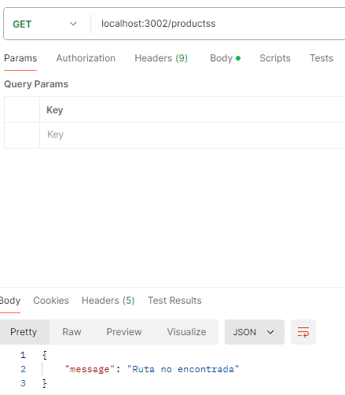

# API de Productos

Esta API permite gestionar una lista de productos con diferentes características. Puedes listar todos los productos o buscar uno específico por su ID.

## Cómo ejecutar

Para iniciar el servidor, ejecuta el siguiente comando en la terminal:

```bash
npm run dev
El servidor se ejecutará en el puerto 3002.

Endpoints
1. GET /products
Devuelve una lista de todos los productos.

URL: http://localhost:3002/products
Método: GET
Respuesta exitosa (200):

[
    { "id": 1, "name": "Laptop", "price": 999.99, "category": "Electronics" },
    { "id": 2, "name": "Chair", "price": 49.99, "category": "Furniture" },
    { "id": 3, "name": "Pen", "price": 1.99, "category": "Stationery" }
]
2. GET /products/
Devuelve los detalles de un producto específico.

URL: http://localhost:3002/products/:id
Método: GET
Parámetros:
id (número): ID del producto que deseas obtener.
Respuesta exitosa (200):

{
    "id": 1,
    "name": "Laptop",
    "price": 999.99,
    "category": "Electronics"
}
Respuesta de error (404):

{
    "message": "Producto no encontrado"
}
3. Rutas no válidas
Si intentas acceder a una ruta que no existe, recibirás un mensaje de error 404.

Respuesta de error (404):

{
    "message": "Ruta no encontrada"
}
Errores comunes
Producto no encontrado: Si intentas acceder a un producto con un ID que no existe, recibirás un mensaje de error 404 con el mensaje "Producto no encontrado".
Ruta no encontrada: Si accedes a una URL diferente a las soportadas, la API devolverá un mensaje de "Ruta no encontrada" con un código de estado 404.
Pruebas en Postman
Para probar los endpoints en Postman:

Abre Postman.
Realiza las pruebas utilizando los ejemplos proporcionados en la sección "Endpoints".

## Evidencia de pruebas en Postman

### Prueba 1: GET /products


### Prueba 2: GET /products/ con ID válido


### Prueba 3: GET /products/ con ID no válido


### Prueba 4: Ruta no válida

